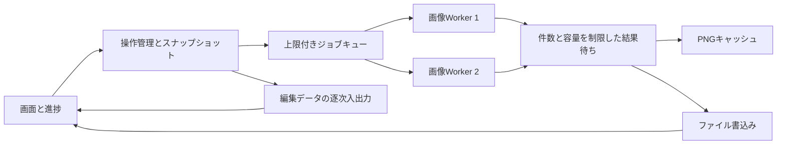

# SOW：数百枚の一括処理の高速化と進捗表示

- 作成日：2026-10-10（日本時間）
- 状態：実装計画。実装結果・受入判定は[実装後報告](../bulk-performance-report.md)へ記録。以下の提案差分は立案時の記録として保持。
- 対象：Serifu Editor、約500枚を扱うブラウザ内の編集・読込・保存
- 調査時HEAD：`b35abd5`
- 調査時ブランチ：`feat/paged-thumbnail-editor`
- 調査範囲：上記HEADと作業ツリーの追加実装。ページ分割・サムネイル・キャプション輪郭の変更が未コミットで存在するため、実装着手時は最新状態を確認する。
- 関連設計：[採用ADR-0010](../adr/0010-bulk-processing-and-progress.md)、[ADR-0008](../adr/0008-paged-editor-and-caption-outlines.md)、[ADR-0001](../adr/0001-static-app-and-export.md)、[ADR-0004](../adr/0004-edit-data-and-drafts.md)
- 依頼解釈：各一括処理に進捗表示を追加する。

## 1. 目的

約500枚を扱う際の読込・一括PNG保存・編集データ保存の待ち時間と画面の停止時間を減らす。各一括処理について、何を何件処理したか、現在の段階、失敗件数、中断結果を画面で確認できるようにする。

性能改善は基準測定と変更後測定で判定する。50件表示は画面の保持量を減らす既存機能として維持し、今回の高速化では全件の読込・エンコード・保存経路を対象にする。

## 2. 現状と調査結果

| 対象 | 現在の処理 | 変更理由 |
|---|---|---|
| フォルダ読込 | フォルダ列挙中に `getFile()` を逐次待機。その後 `addFiles` が各画像を逐次デコード | 最初の編集画面を全件の準備完了まで待つ |
| サムネイル | `createPage` でCanvasを作り、長辺320pxのWebPを `toDataURL()` で同期生成 | メインスレッドの画像変換・文字列生成が枚数分発生する |
| 一括PNG | `saveImages` がデコード・`draw`・`toBlob`・書込みを1枚ずつ完了させる | CPU処理と書込みの待ち時間が重ならない |
| 編集データ | `projectData` が全件を `Promise.all` でBase64化し、全体を `JSON.stringify` | 巨大な文字列と一時メモリ、画面停止が発生する |
| 一時保存 | 全画像の準備、既存IDの存在確認を毎回行う | 変更が少なくても全件の画像準備・照会が走る |
| 一括レイヤー操作 | コピー・カット・貼付け後にカード、設定、全体状態を個別更新 | 大量レイヤーで重複するDOM更新をまとめられる |
| 進捗 | PNG保存の枚数などをfooterの文字列で表示 | 段階、件数、経過時間、中断、失敗の統一表示がない |

`renderer.js` の中間Canvas生成はすでに `OffscreenCanvas` を優先する。共通 `draw` をWorkerから使える可能性がある。ただしWorkerにはDOMのCSSフォント設定が継承されないため、フォント読込と描画一致の確認が必要。

## 3. 実装範囲

### 必須

1. 各処理の時間・件数・処理中画像数・キャッシュ利用量の計測。
2. 全一括処理に共通の進捗表示と中断制御。
3. 同時実行数と保留結果数を制限するジョブキュー。
4. Workerでの画像準備・縮小サムネイル生成・PNG生成。
5. 読込中に準備済みの最初の表示範囲を編集できる動作。
6. PNG生成とファイル書込みを重ねる一括保存。
7. 容量制限付きPNGキャッシュ。
8. 一括レイヤー操作の画面更新の集約。
9. Base64を使わない高速編集データ形式の追加と、従来JSONの読込・出力の維持。
10. 一時保存の既存画像の再準備抑制と、保存トランザクションの整合性維持。
11. ブラウザ非対応時の代替経路、異常系、旧形式の検証。

### 対象外

- バックエンド、画像の外部送信、CUDA、WebGPUによる描画方式の全面変更。
- 新しい「全ページへ書式適用」などの一括編集機能。既存操作の高速化を行う。
- 画質低下、元解像度の変更、元画像の上書き、ページ番号の変更。
- 未計測の速度倍率の保証、元ファイル削除の取消対応。
- このSOWの作成を根拠とするコミット・push・公開。

## 4. 処理構成



### 4.1 操作管理

新規 `bulk-task.js` で、操作ID、状態、段階、成功・失敗・中断を管理する。状態遷移は `idle → running → succeeded / failed / cancelled`。中断要求後は `cancelling` を経由する。

一つの操作につき一つの `AbortController` と不変の操作IDを発行する。終了後のWorker応答・UI更新は操作IDで棄却する。進捗イベントの契約は以下。

```js
{
  operationId, kind, state, stage,
  processed, succeeded, failed, total, // total未確定時はnull
  currentName, elapsedMs,
  completedStages, stageCount,
  writtenBytes, errorMessage
}
```

`processed` は成功・失敗を含めて結果が確定した件数。`succeeded` は段階ごとの実際の完了件数。PNG保存の成功枚数はファイルの `close()` 成功後に加算する。PNG生成完了・キュー投入・IndexedDBへの要求投入だけで保存済みにしない。

現在の `busy` による一律の操作禁止を、操作種別ごとの許可条件へ置き換える。コード上の編集入口、キーボード、ドラッグ、deckのinert、表示設定・サムネイルの制御を同じ判定へ集約する。

| 実行中の操作 | 本文・配置編集 | ページ移動・追加・削除・復元 | 表示範囲・サムネイル移動 | 別の前景一括処理 |
|---|---|---|---|---|
| 画像追加 | 採用済みページのみ許可 | 禁止 | 採用済みページのみ許可 | 禁止 |
| PNG・編集データ・TXTの出力 | 禁止 | 禁止 | 許可。出力対象は開始snapshotを維持 | 禁止 |
| 編集データ読込・復元 | 禁止 | 禁止 | 現在の一覧の参照のみ許可 | 禁止 |
| 一括レイヤー操作 | 準備・適用中は禁止 | 禁止 | 対象が変わらないよう禁止 | 禁止 |
| 手動・自動一時保存のみ | 許可。revisionで後続変更を検出 | 復元・別保存は禁止。それ以外はsnapshotで整合性を維持 | 許可 | PNG等の前景処理はDB処理を待って開始 |

中断ボタン・段階表示は処理中も操作可能にする。編集ロックと表示ロックを同じ `deck.inert` だけで表現せず、許可するナビゲーションと編集操作を区別する。

### 4.2 キューとメモリ上限

- Workerは初期2個、設定可能な内部上限は4個。利用者向けの詳細設定は追加しない。
- 全500件を `Promise.all` に渡さず、空いた枠に次のジョブを渡す。
- 書込み待ちのPNGは最大2件、合計64MiBを初期上限とする。大きい単一結果は1件だけ受け入れ、書込み完了まで次の結果を増やさない。
- 画像ジョブの概算作業容量は少なくとも `幅 × 高さ × 4 × 3` とする。稼働ジョブ合計256MiBを初期予算にして同時実行数を下げる。これは実メモリ使用量の保証値ではなく、割当抑制用の概算。
- 単一画像で予算を超える場合は単独処理する。Canvas制限等で処理できない場合は対象名と理由を通知する。
- Workerごとの字形キャッシュにも上限を設け、現行の5,000,000画素という上限を出発点にする。
- `ImageBitmap.close()`、Canvasの縮小、Object URLの破棄、保留Blobの参照解除を `finally` で実行する。
- Worker終了・タイムアウトで枠が失われても、キューの完了Promiseを必ず解決または拒否する。

## 5. 高速化の詳細

### 5.1 読込とサムネイル

フォルダの列挙では画像名・ハンドルを収集し、対応拡張子の候補を数字順に固定する。`getFile()` と画像準備を上限付きキューへ送る。ファイル選択では候補Fileを同じ経路へ送る。

候補ごとに固定の順序番号を付ける。Worker応答順をページ順として使用しない。先頭から結果が確定した連続部分を順序どおり追加し、失敗した候補は失敗として確定してから次へ進める。

画像の内部表現は `File/Blob + 寸法 + imageId` を基準にし、全件分の `HTMLImageElement` をデコード済みで保持しない。最初の50／100件の準備を優先し、準備済みページを最長100msまたは20件ごとにまとめてUIへ反映する。読み込んだページ数と、候補全体の件数を別表示にする。

サムネイルはWorker内で縮小して `convertToBlob({type:'image/webp', quality:0.75})` を使い、メイン側ではBlobからObject URLを作る。長辺320px、元画像のサムネイル、倍率・状態表示を維持する。Blob方式への変更に伴い `thumbnailSrc` の生成・破棄経路を更新する。

読込中は準備済みページの本文・配置編集と表示範囲の切替を許可する。追加読込、JSON／高速形式読込、一覧削除、ページ順変更、復元、持ち出し保存は完了まで無効にし、候補順と保存対象の確定を守る。自動保存は読込終了まで延期する。中断時は準備済みページを残し、未採用の結果とURLを破棄する。

元画像のEXIF方向、透過、GIFの静止画扱いは既存描画と比較する。`createImageBitmap` 経路と既存デコード経路で寸法・向きが違う場合は、対応を修正するか該当形式を既存経路へ戻す。

### 5.2 WorkerでのPNG生成

新規 `image-worker.js` は `prepare-image`、`render-png`、`reset-fonts` のジョブを受け付ける。メッセージに操作IDとジョブIDを含め、結果にも付ける。

入力は元画像Blob、寸法、複製済みレイヤー、描画設定の版。出力はPNG Blobと処理時間。DOMノード、プレビューCanvas、フォルダハンドル、変更中のページオブジェクトをWorkerへ渡さない。

Workerで元画像を `createImageBitmap` によりデコードし、元解像度のOffscreenCanvasへ共通 `draw` を実行する。PNGは `convertToBlob({type:'image/png'})` で生成する。選択枠は描かない。乱数seed・吹き出し順序・キャプション輪郭・先細りを既存共通経路で保持する。

同梱フォントは `FONT_CATALOG` からURL、ファミリー、ウェイトを取り、Worker内で `FontFace.load()` 後に `self.fonts.add()` を実行する。可変ウェイトの記述と端末フォールバックも既存設定に合わせる。同じWorkerでは読込済み書体を再取得しない。失敗した書体を代替書体で成功扱いにしない。

Worker・OffscreenCanvas・必要なフォントAPIの起動確認に失敗した場合は既存メインスレッド経路を使う。起動障害は一度で切り替え、500件ごとに再起動を試さない。特定のフォント・形式で描画一致が確認できない場合は、そのジョブだけ既存経路を使い、理由を検証ログへ残す。

代替経路も件数・中断を共通管理し、項目間でブラウザへ処理を返す。1枚の重い描画中の中断即応は保証しない。

### 5.3 一括PNG保存

保存ボタンのクリック直後に出力先ダイアログを開き、操作に必要なユーザー操作の有効期間を保持する。フォントロードやキューの待機をダイアログ前に置かない。

出力先確定時点で全体順、対象ページ、レイヤー、原画像参照をスナップショットにする。全画像保存／編集済みだけ保存は表示範囲に依存させない。プレフィックス、全体枚数による桁数、欠番、日時・UUID付き新規フォルダを維持する。

次の画像のPNG生成を、前の画像のファイル書込み中に進める。ファイル書込みの同時実行数は初期1件とし、計測で必要な場合だけ2件まで比較する。結果が順不同でもスナップショットのページ番号で名前を確定する。

PNG後に編集データを保存する段階を進捗へ出す。編集データまで保存できた時だけ一括保存全体を成功扱いにする。部分保存でプロジェクト全体の未保存状態を解除しない。中断・失敗時は作成済みファイルを残し、出力先、成功枚数、編集データの有無を表示する。

### 5.4 PNGキャッシュ

新規 `export-cache.js` にメモリ内LRUを作る。初期上限128MiB。単一Blobが上限を超える場合はキャッシュしない。IndexedDBへのPNGキャッシュ追加は今回不要。

キーは画像の不変ID、元寸法、描画版、書体構成・ロード状態の版、レイヤースナップショットから作る。本文、順序、色、配置、全エフェクト、`glyphSeed`、キャプションの輪郭を含める。ページ番号、出力名、確認済み状態、選択枠、表示倍率は含めない。

画像の追加・削除・置換・復元と、フォント読込状態の変化では関連キーを失効する。Undoで同一の描画状態へ戻った場合は再利用してよい。キャッシュにより生成を省略しても、新しい保存先への書込みと進捗加算は行う。保存元画像は不変として扱い、外部ファイルが変わった状態を同じimageIdに流用しない。

### 5.5 一括レイヤー操作

コピー・カット・ペーストの処理を、データ更新と画面反映に分ける。レイヤーの複製・拡縮を分割実行し、対象レイヤーの処理件数を通知する。1操作につき既存と同じ1チェックポイントを作る。

貼付け・カットの適用前は結果を一時配列へ作り、中断時は既存データ・Undo履歴を変更しない。適用後は当該ページの `renderCards`、`updateControls`、`drawPage`、全体状態更新を各1回にまとめる。非表示ページはデータのみ更新する。50／100件のマウント中もカード追加ごとの全体更新を抑制する。

現行の `syncingView` 抑制と、フォーカス・Delete・コピー・Undoの動作を合わせて検証する。本文入力1文字ごとに全ページのカードやプリセット選択肢を作り直す処理も、変更対象だけへ絞る。

### 5.6 高速編集データ形式と従来JSON

新規 `project-io.js` で、画像Blobと編集メタデータを分けた単一ファイル `.serifu` を追加する。圧縮依存ライブラリは追加しない。PNG/JPEG等の原画像バイト列をそのまま収録する。

コンテナ形式を以下で固定する。

| 領域 | 内容 |
|---|---|
| 0〜7 byte | magic：`53 45 52 49 46 55 00 01`（`SERIFU`、NUL、containerVersion=1） |
| 8〜11 byte | UTF-8 manifestのバイト長、uint32 little endian |
| 12 byte〜 | manifestのUTF-8 JSON |
| manifest直後〜 | manifestのasset配列順に原画像のBlobを連結 |

manifestは `{containerVersion:1, projectVersion:6, preferences, pages, assets}`。ページは `name, assetIndex, layers, done, edited`。assetは `size, mimeType, width, height` を持つ。`src`・サムネイル・フォルダハンドル・DOM・履歴は収録しない。ページ順はmanifest配列順に保持する。元画像バイト数を用いて `Blob.slice()` で各画像を参照する。

読込時はmagic、版、manifest上限16MiB、ページ・asset構造、参照範囲、画像形式、サイズ総和、安全な整数、ファイル全長を検証する。レイヤー検証は既存 `normalizeLayer` を通す。途中の不正データで現在の一覧を部分変更しない。

編集データ保存欄に「高速形式 (.serifu)／従来形式 (.json)」を追加し、高速形式を初期選択にする。一括PNGに添える編集データも選択形式に従い、`serifu-project.serifu` または既存 `serifu-project.json` を出力する。形式変更は利用者向け表示とHANDOFFへ明記する。

ダウンロード方式ではヘッダ・manifest・原画像Blobから `new Blob(parts)` を作り、画像全体のBase64文字列を生成しない。直接フォルダ保存では `createWritable()` にヘッダ、manifest、各原画像を順番に書く。利用者が選択した高速ファイルも、従来JSONも同じ読込ボタンで読み込めるようにする。

従来JSONのversion 1〜6とキャプション追加項目を維持する。JSONの出力はページごとに逐次エンコードし、書込み先にバックプレッシャーを掛ける。巨大な全体オブジェクトへの `JSON.stringify` と無制限のFileReader並列実行を避ける。JSON読込の `JSON.parse` は専用のWorkerジョブへ移し、失敗時は一覧を変更しない。

高速形式では編集モデルの `PROJECT_VERSION=6` を維持し、コンテナ版を独立管理する。既存版のアプリは `.serifu` を読めないため、従来JSONの出力を残す。この形式変更は採用ADR-0010の主要判断として記録する。

### 5.7 一時保存と自動保存

保存済み画像IDを `getImageIds()` で操作ごとに1回取得する。既存画像はBlobの再取得を省き、新規画像だけを準備する。変更メタデータと追加画像、一覧から消えた画像の除去は現行と同じ一つのreadwriteトランザクションで確定する。

トランザクション開始後に画像デコードや任意の外部非同期処理を挟まない。IndexedDBの進捗は画像要求の成功件数と最終コミットを分けて表示する。コミット前に100%・保存済みと表示しない。

保存開始revisionを記録し、処理中の追加編集を保存済みにしない。自動保存は前景の一括処理中と、読込の未完了時に延期する。終了後に変更があれば保存を1回予約し、重複した周期分を一斉実行しない。

## 6. 各一括処理の進捗表示

### 6.1 画面

`index.html` に操作名、段階、HTML `progress`、処理件数、成功・失敗件数、対象名、経過時間、中断ボタンを持つ共通パネルを追加する。固定footerを大きくせず、表示設定欄の直下に置く。狭い画面では項目を折り返す。

- 表示例：`一括PNG保存 · PNG生成と書込み · 138 / 500枚 · 保存済み136枚 · 失敗0枚 · 01:24`。
- 段階例：`段階2 / 3：画像保存 138 / 500枚（27%）`。段階割合を操作全体の割合として表示しない。
- 総数未確定のフォルダ列挙は不定進捗。処理済み件数だけを表示する。
- 複数段階は段階番号・段階内件数を表示する。処理時間の重みを仮定した全体パーセントは作らない。
- 現在のファイル名は横幅で省略し、完全名をtitle／アクセシブル名で確認できるようにする。
- UI更新は100ms間隔を上限にまとめる。開始、段階変更、中断、失敗、終了は即時通知する。
- `aria-busy`、`role=status`、ラベル付きprogressを設定し、件数の毎更新を音声通知しない。段階・完了・失敗を通知する。
- 中断・失敗時の完了件数はその場に残す。新しい前景操作を開始した時に更新する。
- 自動保存の進捗は既存 `draftStatus` に簡潔に表示し、前景操作のパネルを上書きしない。
- 推定残り時間は初回実装の必須項目にしない。経過時間を表示する。

### 6.2 対象と完了基準

| 操作 | 段階と単位 | 成功の確定点 |
|---|---|---|
| フォルダ／画像追加 | 列挙（件）、画像準備（枚）、表示反映（枚） | 対象ページの準備と採用が完了 |
| 一括PNG保存 | 書体準備、画像生成・書込み（枚）、編集データ（画像数・byte） | PNGと編集データの書込みclose完了 |
| 編集済み画像一括保存 | 上と同じ。totalは抽出対象枚数 | 対象一式の書込みclose完了 |
| 編集データ保存 | メタ情報準備、原画像収録またはJSON変換（枚・byte）、出力準備 | 直接保存はclose完了、ダウンロードは準備・開始まで |
| 編集データ読込 | ファイル解析、検証、画像準備（枚）、一覧反映 | 全データ検証後の一覧への採用完了 |
| 一時保存／自動保存 | 画像差分準備（枚）、DB要求、コミット | IndexedDBトランザクションcomplete |
| 一時保存復元 | メタ情報、画像取得、画像準備（枚）、一覧置換 | 全件の検証・準備後の一覧置換完了 |
| 本文テキスト出力 | ページ走査（枚）、整形、出力準備 | TXTのダウンロード準備・開始まで |
| 文字を一括コピー／カット／ペースト・次画像へ複製 | レイヤー準備（件）、データ適用、画面反映 | データ適用と必要な画面更新完了 |

ブラウザの通常ダウンロードではディスクへの保存完了を確認できない。「保存完了」ではなく「ダウンロード開始」と表示する。対象ゼロは0除算せず「対象なし」として即終了する。

### 6.3 中断と失敗

| 操作 | 中断・失敗時の扱い |
|---|---|
| 画像追加 | 準備済みで採用済みのページを残す。追加成功・失敗・未処理を分ける。個別デコード失敗は他の画像を続行 |
| PNG保存 | 新規投入を止め、未確定の書込みをabort。作成済みファイルを残し、フォルダと実保存枚数を表示。書込み障害は操作を停止 |
| 高速形式／JSONの読込・復元 | 採用前に中断し、現在の一覧を保つ。不要Blob URLを破棄 |
| 編集データ直接保存 | 書込み中のwriterをabort。ファイルシステムに空ファイル等が残る可能性を成功扱いにしない |
| IndexedDB保存 | トランザクションをabortして前回保存を保つ。complete後の中断は保存完了として扱う |
| コピー・カット・ペースト | データ適用前の中断は既存データ・履歴を保つ。同期適用区間を途中で切らない |
| TXT／通常ダウンロード | 生成中の中断に対応。ダウンロード開始後はアプリ側で取消可能と表示しない |

Workerの同期描画中はメッセージによる中断を即時処理できない。中断要求時は新規投入を停止し、稼働Workerは最大2秒待って応答がなければterminateする。次の操作では必要なWorkerを再作成する。終了した操作の応答はUI・キャッシュ・保存先へ反映しない。

## 7. 予定変更の提案差分

以下はすべて実装前の提案差分。今回のSOW作成で実装済みになったものはない。

| ファイル | 提案変更 |
|---|---|
| `app.js` | `guard`／`busy`を操作種別に応じた管理へ整理。読込の先行表示、キュー呼出し、進捗、キャッシュ、形式選択、一時保存差分、終了時の解放を接続 |
| `bulk-task.js`（新規） | 操作状態、進捗集約、中断、分割処理、画面更新抑制 |
| `bulk-pool.js`（新規） | Worker起動確認、上限付きキュー、応答照合、タイムアウト、容量予算、代替経路 |
| `image-worker.js`（新規） | 画像準備、サムネイルBlob、フォントロード、共通描画、PNG Blob、解放 |
| `export-cache.js`（新規） | 描画状態キー、128MiB上限のLRU、失効、利用計測 |
| `project-io.js`（新規） | 高速コンテナの入出力、旧JSONの逐次出力、形式検証、保存先への書込み |
| `project-worker.js`（新規） | JSON解析・ページごとのJSON変換。画像Workerを大きなJSON処理で占有しない |
| `fonts.js` | DOMとWorkerで共有するフォント定義・ロード情報を整理 |
| `renderer.js`／`ink.js`／`captions.js`等 | 必要なWorker対応と描画一致修正。共通 `draw` とseed・配置の仕様を維持 |
| `storage.js` | 既存画像IDの一括取得、準備差分、進捗、トランザクション取消。DBスキーマ版は維持 |
| `index.html`／`style.css` | 進捗パネル、中断、編集データ形式選択、狭い画面・アクセシビリティ |
| `server.mjs`／`scripts/build.mjs` | 新規JSとWorkerを明示許可・配布リストへ追加。Pagesの相対パスで動作 |
| `package.json` | 新規JSの構文確認、関連ブラウザ検証、性能計測コマンド |
| `test/bulk-task.test.mjs`等（新規） | 状態・中断・キュー上限・LRU失効・コンテナ検証などの意味のある単体検証 |
| `scripts/bulk-smoke.mjs`（新規） | Worker、進捗、並列順序、代替経路、旧形式、失敗、中断、500件保存 |
| `scripts/bulk-benchmark.mjs`（新規） | 同一fixtureの基準・変更後の段階別測定と結果出力 |
| `dev/docs/HANDOFF.md`／ADR一覧 | 実装後の仕様、検証結果、制約、採用ADRを反映。既存の作業中変更と統合 |

主要関数の置換イメージ：

```diff
- addFiles: 全件を逐次 decode → 同期 toDataURL → 最後に表示
+ addFiles: 順序固定 → 優先キュー → Worker準備 → Blobサムネイル → 分割して採用・表示
- saveImages: 各ページ imageBlob → write → 全件Base64 JSON
+ saveImages: 不変snapshot → cache/Worker → 上限付き結果待ち → write → 選択形式の逐次出力
- 一括操作: 途中の変更ごとにカード・全体状態を再構築
+ 一括操作: 準備を分割 → 1回の履歴・データ適用 → 1回の画面反映
- createPage: HTMLImageとサムネイルData URLの生成を担当
+ createPage: 準備結果をモデルへ組み込み、画像表示は必要時に読込
```

## 8. 実装順序と成果物

| 順序 | 実装と成果物 | 次へ進む条件 |
|---|---|---|
| 1 | 段階別計測、既存fixtureと500件fixtureの基準結果 | 基準コード・画像構成・ブラウザ・結果を記録 |
| 2 | 操作管理、全一括処理の進捗、分割処理と中断 | 件数・成功判定・旧操作の互換が検証成功 |
| 3 | 上限付きキュー、Workerフォント・描画、代替経路 | 主要書体と各レイヤーの描画一致・異常系が成功 |
| 4 | PNGパイプライン、キャッシュ、容量・順序制御 | 500件の出力、再保存、取消、途中失敗が成功 |
| 5 | 先行読込、Blobサムネイル、UI更新集約、一時保存差分 | 読込中編集・順序・復元・Undoが成功 |
| 6 | 高速形式、従来JSONの入出力、形式選択 | 旧形式と新形式の往復・破損検証が成功 |
| 7 | 同条件での性能比較、並列数の調整、文書更新 | 受入条件を満たし、実測と残った制約を記録 |

性能計測結果はGit管理外の `artifacts/bulk-benchmark/` へJSONで出力する。代表結果と比較条件を `dev/docs` の実装後報告へ日本語で記録する。元画像・個人ファイル名は計測報告へ転載しない。

## 9. 検証・受入条件

### 9.1 機能・整合性

- 500件で50／100件・全表示、サムネイル倍率・表示切替、範囲をまたぐ完了・複製・ページ移動・Delete・Undoが動く。
- PNG全件保存は500件、編集済み抽出は該当件数、JSON／高速形式／TXTは表示範囲外も含む正しい対象を出力する。
- 並列完了順を人工的に入れ替えても読込・出力名・ページ配列が一致する。
- 元寸法・透過・方向を維持し、同一環境でWorker PNGと選択枠なしの既存プレビューのデコード後RGBAを比較する。PNG圧縮バイト列の一致は要求しない。
- 同梱19書体・端末書体、漢字フォールバック、台詞、強い効果音、吹き出し、キャプション輪郭、句読点・先細りの代表fixtureを含める。不一致の対象は代替経路へ切り替える。
- 書体失敗、Worker起動失敗・クラッシュ、Canvas失敗、書込み失敗、JSON破損、高速形式の参照範囲破損、IndexedDB中断を成功扱いにしない。
- キャッシュが本文・効果・配置・輪郭・書体変更で失効し、ページ移動や選択だけでは再描画を要求しない。
- 再読込・復元・形式の往復で画像バイト列、レイヤー、ページ順、確認済み・編集済み状態を保持する。
- 既存のJSON名・versionを検証するブラウザテストでは、従来JSONを明示選択する。追加テストで高速形式の初期選択と一括保存への添付を検証し、旧テストの期待値だけを書き換えて形式互換を省かない。
- 全一括操作に段階・件数・経過時間・終了状態があり、総数不明・ゼロ件・失敗・中断で表示が破綻しない。
- 中断後、次の操作が正常に開始でき、古い応答が新しい操作へ混入しない。
- IndexedDBへのコミット前に保存済み表示にならず、保存中の後続編集は未保存として残る。

### 9.2 性能

計測fixtureは少なくとも次の3種類。各500枚、表示設定・書体・ブラウザを固定し、基準・変更後を各3回測定して中央値を比較する。

1. 小画像：既存の500件操作fixture。機能・上限検証用。
2. 中画像：1280×1920の生成画像。未編集、台詞、キャプションを混在。
3. 重い画像：1920×2560の生成画像。20%のページにブラー・掠れ等の強い効果音を配置。

原画像が単色PNGだけの結果を利用者の実画像性能として報告しない。実画像での追加測定は、別途利用可能な画像が提供された場合に行う。

必須記録は全体時間、最初の編集可能ページまでの時間、書体・デコード・描画・PNG・書込み・編集データの時間、操作応答遅延、キュー最大稼働数・保留byte・キャッシュbyte。取得できる範囲のメモリを記録し、ブラウザ固有値とアプリの容量推定を区別する。

- 最初の表示範囲が、残りの画像準備完了を待たずに編集可能になる。
- 2枚以上のジョブが存在し容量予算に収まるケースで、生成と書込みが重なる。
- アプリが管理する稼働数・保留結果・キャッシュが設定上限を守る。
- キャッシュに収まる未変更ページの再保存で、PNG再生成ジョブ数が0になる。
- 性能目標：中画像・重い画像のCPU処理段階の中央値を基準から30%以上短縮し、読込中・保存中の前景操作応答遅延の95パーセンタイルを200ms以内にする。達成は未確認で、事前保証ではない。
- 全体時間にディスク・ダイアログ等が支配的な場合も段階別結果を示す。改善未達時は並列数1／2／4を比較し、残る支配段階・対応案を記録してSOWの受入判定を見直す。未達を成功と記載しない。
- 50件の通常編集で基準から10%を超える応答性能の悪化があれば調査・修正する。

検証は影響する最小セットから開始し、変更していない成功済み検証を繰り返さない。最終的に構文、関連単体、既存ブラウザ検証と追加bulk検証、静的ビルド、差分の空白確認を行う。localhostとPages相当のサブパスでWorker・フォントが読めることも確認する。

## 10. リスクと対策

| リスク | 対策 |
|---|---|
| 並列化で画像・中間Canvas・PNGが大量に残る | 稼働枠、画素予算、結果待ち、LRUを別々に制限しfinallyで解放 |
| Workerとプレビューで書体・字形が変わる | 同梱書体ロード、RGBA比較、対象別の代替経路 |
| 読込中編集で追加順・保存対象が変わる | 候補番号固定、採用済みページだけ編集、構造変更と持ち出し保存を完了まで無効化 |
| キャッシュで古い画像を出力する | 描画に影響する全入力をキー化し、原画像ID・書体版を失効条件にする |
| 巨大JSONでUI・メモリが停止する | 高速形式、逐次JSON、解析Worker、メモリ上限 |
| 新形式が既存版で読めない | 従来JSON出力・読込を維持し、形式選択と制約を文書化 |
| 中断時の遅延応答・部分ファイル・DB不整合 | 操作ID照合、writer/transaction abort、実完了件数、前回保存の維持 |
| フォルダAPI非対応 | 既存の代替読込・通常ダウンロードを維持。直接一括フォルダ保存の対応条件は維持 |
| 実測せずに並列数を増やす | 基準比較と1／2／4の実測で決める |

## 11. 参考仕様

- [OffscreenCanvas](https://developer.mozilla.org/en-US/docs/Web/API/OffscreenCanvas)：Workerでの描画。
- [WorkerGlobalScope.fonts](https://developer.mozilla.org/en-US/docs/Web/API/WorkerGlobalScope/fonts)：Worker内のFontFaceSet。
- [createImageBitmap](https://developer.mozilla.org/en-US/docs/Web/API/Window/createImageBitmap)：Blob等からの画像準備、寸法・方向の扱い。
- [OffscreenCanvas.convertToBlob](https://developer.mozilla.org/en-US/docs/Web/API/OffscreenCanvas/convertToBlob)：Worker内の画像Blob生成。
- [HTMLCanvasElement.toDataURL](https://developer.mozilla.org/en-US/docs/Web/API/HTMLCanvasElement/toDataURL)：画像全体の文字列生成に伴う性能上の注意。

## 12. 完了時の報告

実装した操作、進捗と中断の動作、形式変更、性能比較、描画互換、代替経路、未達・未検証項目を日本語で報告する。重要な設計の採用時は提案ADRを更新し、ADR一覧とHANDOFFへ反映する。

ユーザーが許可するまでコミット・push・公開を行わない。実装と検証完了後に命名規則に沿うコミット案を提示して確認する。本書自体は提案仕様であり、実装・性能改善・検証成功の記録ではない。
